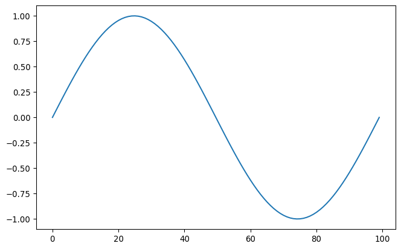

export const quartoRawHtml =
[`<div>
<style scoped>
    .dataframe tbody tr th:only-of-type {
        vertical-align: middle;
    }
    .dataframe tbody tr th {
        vertical-align: top;
    }
    .dataframe thead th {
        text-align: right;
    }
</style>
`,`
<table class="dataframe" data-quarto-postprocess="true" data-border="1">
<thead>
<tr style="text-align: right;">
<th data-quarto-table-cell-role="th"></th>
<th data-quarto-table-cell-role="th">name</th>
<th data-quarto-table-cell-role="th">created_at</th>
<th data-quarto-table-cell-role="th">description</th>
<th data-quarto-table-cell-role="th">status</th>
<th data-quarto-table-cell-role="th">submitted</th>
<th data-quarto-table-cell-role="th">E</th>
<th data-quarto-table-cell-role="th">T</th>
<th data-quarto-table-cell-role="th">bottom_curve</th>
<th data-quarto-table-cell-role="th">dt</th>
<th data-quarto-table-cell-role="th">eps</th>
<th data-quarto-table-cell-role="th">...</th>
<th data-quarto-table-cell-role="th">nu</th>
<th data-quarto-table-cell-role="th">quadrature_degree</th>
<th data-quarto-table-cell-role="th">residual_factor</th>
<th data-quarto-table-cell-role="th">rho</th>
<th data-quarto-table-cell-role="th">rho_inf</th>
<th data-quarto-table-cell-role="th">rigid_v</th>
<th data-quarto-table-cell-role="th">time_step_factor</th>
<th data-quarto-table-cell-role="th">top_curve</th>
<th data-quarto-table-cell-role="th">used_dt</th>
<th data-quarto-table-cell-role="th">write_every</th>
</tr>
</thead>
<tbody>
<tr>
<td data-quarto-table-cell-role="th">0</td>
<td>3b228f0689</td>
<td>2025-03-27 16:25:16.730489</td>
<td></td>
<td>finished</td>
<td>True</td>
<td>40.0</td>
<td>1.0</td>
<td>{'amp': 0.1, 'end': 2.6, 'frequency': 1, 'star...</td>
<td>1.0</td>
<td>0.05</td>
<td>...</td>
<td>0.3</td>
<td>4.0</td>
<td>0.001</td>
<td>0.2</td>
<td>0.98</td>
<td>[1.0, 0.0]</td>
<td>5.0</td>
<td>{'amp': 0.1, 'end': 3.2, 'frequency': 2, 'star...</td>
<td>0.004775</td>
<td>5.0</td>
</tr>
<tr>
<td data-quarto-table-cell-role="th">1</td>
<td>7408479385</td>
<td>2025-03-25 11:23:29.402630</td>
<td></td>
<td>initialized</td>
<td>False</td>
<td>NaN</td>
<td>NaN</td>
<td>NaN</td>
<td>NaN</td>
<td>NaN</td>
<td>...</td>
<td>NaN</td>
<td>NaN</td>
<td>NaN</td>
<td>NaN</td>
<td>NaN</td>
<td>NaN</td>
<td>NaN</td>
<td>NaN</td>
<td>NaN</td>
<td>NaN</td>
</tr>
<tr>
<td data-quarto-table-cell-role="th">2</td>
<td>946a651d11</td>
<td>2025-03-28 09:00:22.244929</td>
<td></td>
<td>failed [\n\n*** ------------------------------...</td>
<td>True</td>
<td>40.0</td>
<td>1.0</td>
<td>{'amp': 0.25, 'end': 2.6, 'frequency': 1, 'sta...</td>
<td>1.0</td>
<td>0.05</td>
<td>...</td>
<td>0.3</td>
<td>4.0</td>
<td>0.001</td>
<td>0.2</td>
<td>0.98</td>
<td>[1.75, 0.0]</td>
<td>10.0</td>
<td>{'amp': 0.5, 'end': 3.2, 'frequency': 2, 'star...</td>
<td>0.009550</td>
<td>5.0</td>
</tr>
<tr>
<td data-quarto-table-cell-role="th">3</td>
<td>d26431b536</td>
<td>2025-03-28 09:04:41.539729</td>
<td></td>
<td>failed [\n\n*** ------------------------------...</td>
<td>True</td>
<td>40.0</td>
<td>1.0</td>
<td>{'amp': 0.125, 'end': 2.6, 'frequency': 1, 'st...</td>
<td>1.0</td>
<td>0.05</td>
<td>...</td>
<td>0.3</td>
<td>4.0</td>
<td>0.001</td>
<td>0.2</td>
<td>0.98</td>
<td>[1.75, 0.0]</td>
<td>10.0</td>
<td>{'amp': 0.5, 'end': 3.2, 'frequency': 2, 'star...</td>
<td>0.009550</td>
<td>5.0</td>
</tr>
<tr>
<td data-quarto-table-cell-role="th">4</td>
<td>d4893620e0</td>
<td>2025-03-28 08:54:19.710545</td>
<td></td>
<td>failed [\n\n*** ------------------------------...</td>
<td>True</td>
<td>40.0</td>
<td>1.0</td>
<td>{'amp': 0.25, 'end': 2.6, 'frequency': 1, 'sta...</td>
<td>1.0</td>
<td>0.05</td>
<td>...</td>
<td>0.3</td>
<td>4.0</td>
<td>0.001</td>
<td>0.2</td>
<td>0.98</td>
<td>[1.75, 0.0]</td>
<td>10.0</td>
<td>{'amp': 0.5, 'end': 3.2, 'frequency': 2, 'star...</td>
<td>0.009550</td>
<td>5.0</td>
</tr>
<tr>
<td data-quarto-table-cell-role="th">5</td>
<td>dbb19cd293</td>
<td>2025-04-29 13:41:21.226789</td>
<td></td>
<td>started</td>
<td>False</td>
<td>40.0</td>
<td>1.0</td>
<td>{'amp': 0.125, 'end': 2.6, 'frequency': 1, 'st...</td>
<td>1.0</td>
<td>0.05</td>
<td>...</td>
<td>0.3</td>
<td>4.0</td>
<td>0.001</td>
<td>0.2</td>
<td>0.98</td>
<td>[1.75, 0.0]</td>
<td>10.0</td>
<td>{'amp': 0.5, 'end': 3.2, 'frequency': 2, 'star...</td>
<td>0.009550</td>
<td>5.0</td>
</tr>
<tr>
<td data-quarto-table-cell-role="th">6</td>
<td>f96534a0b5</td>
<td>2025-03-27 17:01:17.104536</td>
<td></td>
<td>started</td>
<td>False</td>
<td>40.0</td>
<td>1.0</td>
<td>{'amp': 0.1, 'end': 2.6, 'frequency': 1, 'star...</td>
<td>1.0</td>
<td>0.05</td>
<td>...</td>
<td>0.3</td>
<td>4.0</td>
<td>0.001</td>
<td>0.2</td>
<td>0.98</td>
<td>[1.75, 0.0]</td>
<td>5.0</td>
<td>{'amp': 0.1, 'end': 3.2, 'frequency': 2, 'star...</td>
<td>0.004775</td>
<td>5.0</td>
</tr>
<tr>
<td data-quarto-table-cell-role="th">7</td>
<td>fcf65de5d1</td>
<td>2025-03-27 15:25:03.830086</td>
<td></td>
<td>finished</td>
<td>True</td>
<td>40.0</td>
<td>1.0</td>
<td>{'amp': 0.1, 'end': 2.6, 'frequency': 1, 'star...</td>
<td>1.0</td>
<td>0.05</td>
<td>...</td>
<td>0.3</td>
<td>4.0</td>
<td>0.001</td>
<td>0.2</td>
<td>0.98</td>
<td>[1.0, 0.0]</td>
<td>5.0</td>
<td>{'amp': 0.1, 'end': 3.2, 'frequency': 2, 'star...</td>
<td>0.004775</td>
<td>5.0</td>
</tr>
<tr>
<td data-quarto-table-cell-role="th">8</td>
<td>test</td>
<td>2025-03-27 12:21:58.284097</td>
<td></td>
<td>finished</td>
<td>True</td>
<td>40.0</td>
<td>1.0</td>
<td>{'amp': 0.05, 'end': 2.6666666666666665, 'freq...</td>
<td>1.0</td>
<td>0.05</td>
<td>...</td>
<td>0.3</td>
<td>4.0</td>
<td>0.001</td>
<td>0.2</td>
<td>0.98</td>
<td>[1.0, 0.0]</td>
<td>5.0</td>
<td>{'amp': 0.05, 'end': 3.0, 'frequency': 3, 'sta...</td>
<td>0.004775</td>
<td>5.0</td>
</tr>
</tbody>
</table>
`,`
<p>9 rows × 25 columns</p>
</div>`];


```python
import bamboost

coll = bamboost.Collection.fromUID["A529F9DDB8 - projects/25-rough-surface/data"]
coll.df
```

<div dangerouslySetInnerHTML={{ __html: quartoRawHtml[0] }} />

<div dangerouslySetInnerHTML={{ __html: quartoRawHtml[1] }} />

<div dangerouslySetInnerHTML={{ __html: quartoRawHtml[2] }} />


```python
import matplotlib.pyplot as plt
import numpy as np

plt.plot(np.sin(np.linspace(0, 2 * np.pi, 100)))
```



## Some more information

$$a + b = \int x dt$$

:::note

This is a note

:::
